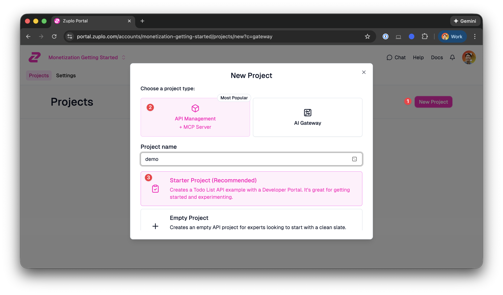
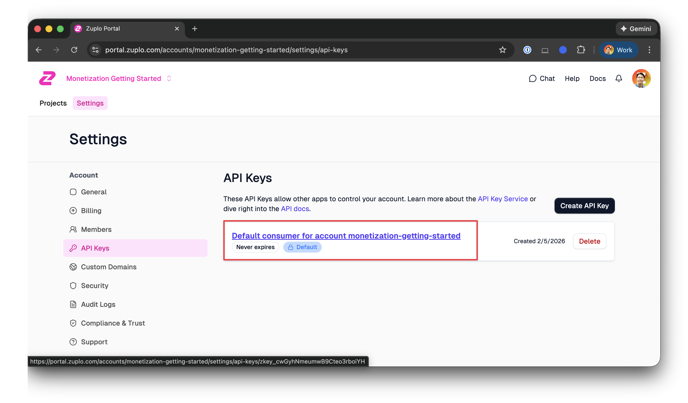
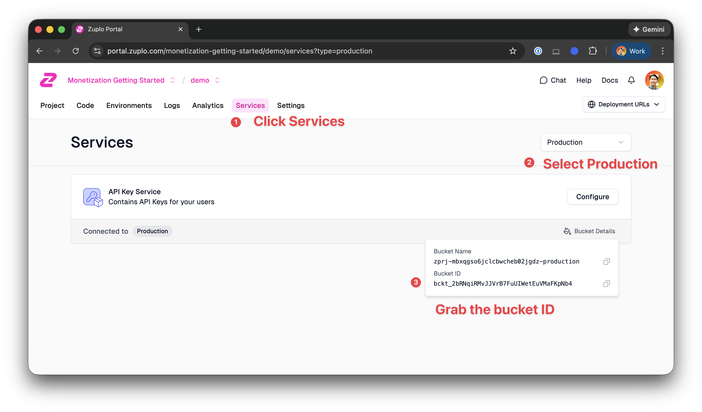
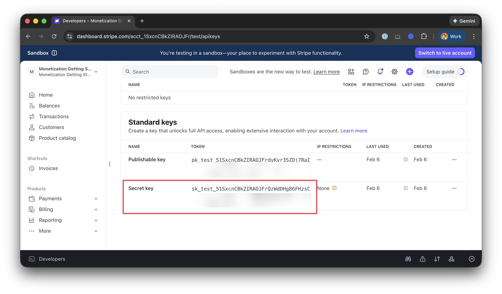
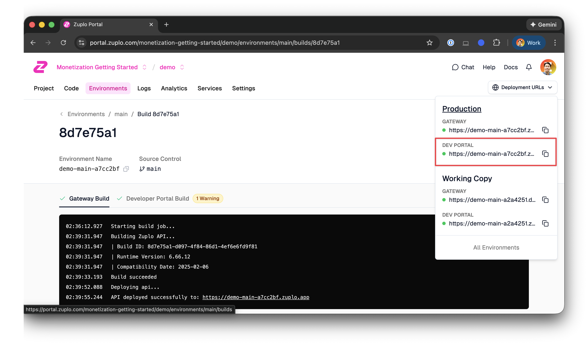
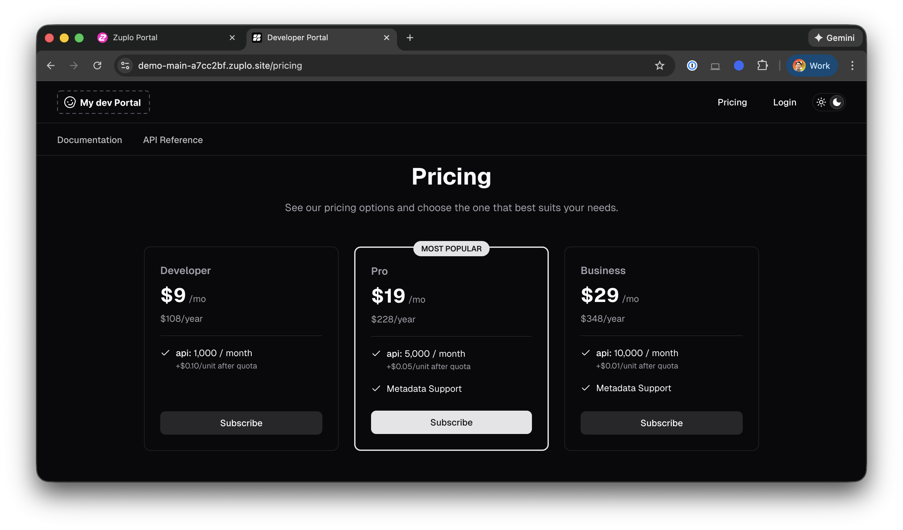
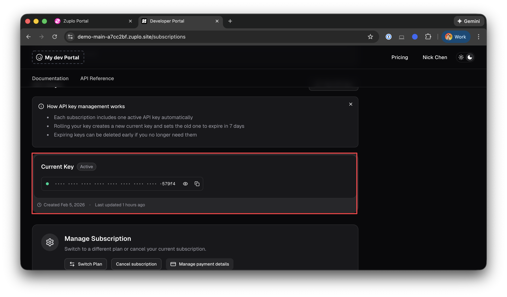
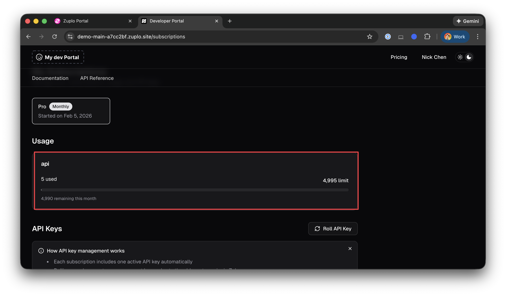

# Early Access: Getting Started with Monetization on Zuplo

## Introduction

Welcome to the Early Access preview of Zuplo's Monetization feature! This guide
will walk you through everything you need to start earning revenue from your
APIs with native metering, real-time usage tracking, and seamless billing — all
built right into your API gateway.

For a broader overview of Zuplo's monetization capabilities and available
integrations, see our
[API Monetization documentation](https://zuplo.com/docs/articles/monetization).

Since this is an early preview, the API may evolve as we refine things. We'd
love to hear your feedback along the way!

By the end of this guide, you'll have a working API with monetization fully
enabled. Your users will be able to subscribe to plans and track their usage in
real time.

**Prerequisites:** This guide assumes you're already familiar with the basics of
Zuplo. Need a refresher? Check out our
[quick start guide](https://zuplo.com/docs/articles/step-1-setup-basic-gateway).

## Create a new project

**Important:** Please use a fresh project for this guide. Since monetization is
still in preview, we want to make sure your existing work stays safe from any
breaking changes.

1. Head over to [portal.zuplo.com](https://portal.zuplo.com) and sign in to your
   account. Click on "New Project" on the top right corner.
1. Select new **API Management (+ MCP Server)** project.
1. Select **Starter Project (Recommended)**— it comes with some endpoints ready
   to monetize, which makes following along much easier.
   
1. Connect your project to source control by following our
   [GitHub setup guide](https://zuplo.com/docs/articles/source-control-setup-github).

## Clone the project and work on it locally

For now, you'll need to make a few edits locally to enable monetization in your
developer portal. Don't worry — it's just a couple of quick changes! (We're
working on bringing full editing support to the portal soon.)

1. Clone your project's repository to your local machine.

2. Open `docs/package.json` and add the monetization plugin to your
   dependencies:

   ```json
   "@zuplo/zudoku-plugin-monetization": "0.0.15"
   ```

3. Next, open `docs/zudoku.config.tsx` and wire up the plugin:

   ```tsx
   // Add this import at the top of the file
   import { zuploMonetizationPlugin } from "@zuplo/zudoku-plugin-monetization";

   // Then add the plugin to your plugins array
   const config: ZudokuConfig = {
     // ... your existing config
     plugins: [
       zuploMonetizationPlugin(),
       // ... any other plugins you have
     ],
     // ...
   };
   ```

4. Push your changes to the main/master branch and ensure that a new environment
   is deployed.

## Get your API key

Since this is an early preview, we'll use the
[Zuplo Monetization API](https://zuplo.com/docs/articles/monetization#zuplo-monetization-api-preview)
to set up meters, features, and plans. You'll need your API key for this.

1. Go to **Settings > API Keys** in the [Zuplo Portal](https://portal.zuplo.com)
   (found under your account settings).
   

In the examples below, we'll refer to your API key as `ZUPLO_API_KEY`.

## Get your bucket ID

Each project in Zuplo has three "buckets":

- **Development/working-copy** — used for local development and your working
  copy
- **Preview** — used for non-main branches in source control
- **Production** — used for your main/master branch

A bucket isolates the configuration for each environment. Think of it as a
namespace — the settings you configure in one bucket won't affect the others.

Since we're deploying to the main/master branch, we'll use the **production**
bucket.



Copy the bucket ID. We'll refer to it as `ZUPLO_BUCKET_ID` in the examples
below.

---

**Want to skip ahead?** We've included a script that runs all the API calls for
you. It will prompt you for the required values:

```bash
./scripts/setup-monetization.sh
```

Or continue below to run each step manually and learn how everything fits
together.

---

## Create a meter

Meters are the foundation of usage-based billing — they track what you want to
measure. Think of a meter as a counter that keeps track of things like API
calls, tokens processed, or data transferred.

Let's create a meter that tracks API requests:

```bash
curl -X POST "https://dev.zuplo.com/v3/metering/${ZUPLO_BUCKET_ID}/meters" \
  -H "Authorization: Bearer ${ZUPLO_API_KEY}" \
  -H "Content-Type: application/json" \
  -d '{
    "slug": "api",
    "name": "API",
    "description": "API Calls",
    "eventType": "api",
    "aggregation": "SUM",
    "valueProperty": "$.total"
  }'
```

A few things to note:

- **slug**: A unique identifier for this meter (you'll reference this later)
- **eventType**: The type of event to listen for
- **aggregation**: How to combine values (SUM, COUNT, MAX, etc.)
- **valueProperty**: A JSONPath expression to extract the value from events

## Create features

Features define what your customers get access to. They can be tied to meters
(for usage-based features) or standalone (for boolean features like "Metadata
Support").

We'll create three features for our plans:

**1. API Feature** (linked to our meter):

```bash
curl -X POST "https://dev.zuplo.com/v3/metering/${ZUPLO_BUCKET_ID}/features" \
  -H "Authorization: Bearer ${ZUPLO_API_KEY}" \
  -H "Content-Type: application/json" \
  -d '{
    "key": "api",
    "name": "API",
    "meterSlug": "api"
  }'
```

**2. Monthly Fee Feature** (for flat-rate billing):

```bash
curl -X POST "https://dev.zuplo.com/v3/metering/${ZUPLO_BUCKET_ID}/features" \
  -H "Authorization: Bearer ${ZUPLO_API_KEY}" \
  -H "Content-Type: application/json" \
  -d '{
    "key": "monthly_fee",
    "name": "Monthly Fee"
  }'
```

**3. Metadata Support Feature** (a boolean feature):

```bash
curl -X POST "https://dev.zuplo.com/v3/metering/${ZUPLO_BUCKET_ID}/features" \
  -H "Authorization: Bearer ${ZUPLO_API_KEY}" \
  -H "Content-Type: application/json" \
  -d '{
    "key": "metadata_support",
    "name": "Metadata Support"
  }'
```

## Create plans

Now for the fun part — let's create some pricing plans! Plans bring together
your features with pricing and entitlements. We'll create three plans to give
your customers options:

| Plan      | Monthly Fee | Included Requests | Overage Rate | Metadata Support |
| --------- | ----------- | ----------------- | ------------ | ---------------- |
| Developer | $9.99       | 1,000             | $0.10/req    | No               |
| Pro       | $19.99      | 5,000             | $0.05/req    | Yes              |
| Business  | $29.99      | 10,000            | $0.01/req    | Yes              |

### Developer Plan

The entry-level plan for developers getting started:

```bash
curl -X POST "https://dev.zuplo.com/v3/metering/${ZUPLO_BUCKET_ID}/plans" \
  -H "Authorization: Bearer ${ZUPLO_API_KEY}" \
  -H "Content-Type: application/json" \
  -d '{
    "billingCadence": "P1M",
    "currency": "USD",
    "description": "1000 requests per month with overages",
    "key": "developer",
    "metadata": {
      "zuplo_plan_order": "1"
    },
    "name": "Developer",
    "proRatingConfig": {
      "enabled": false,
      "mode": "prorate_prices"
    },
    "phases": [
      {
        "duration": null,
        "key": "default",
        "name": "Default",
        "rateCards": [
          {
            "billingCadence": "P1M",
            "featureKey": "monthly_fee",
            "key": "monthly_fee",
            "name": "Monthly Fee",
            "price": {
              "amount": "9.99",
              "paymentTerm": "in_advance",
              "type": "flat"
            },
            "type": "flat_fee"
          },
          {
            "billingCadence": "P1M",
            "entitlementTemplate": {
              "isSoftLimit": true,
              "issueAfterReset": 1000,
              "preserveOverageAtReset": false,
              "type": "metered",
              "usagePeriod": "P1M"
            },
            "featureKey": "api",
            "key": "api",
            "name": "api",
            "price": {
              "mode": "graduated",
              "tiers": [
                {
                  "flatPrice": {
                    "amount": "0",
                    "type": "flat"
                  },
                  "unitPrice": null,
                  "upToAmount": "1000"
                },
                {
                  "flatPrice": null,
                  "unitPrice": {
                    "amount": "0.10",
                    "type": "unit"
                  }
                }
              ],
              "type": "tiered"
            },
            "type": "usage_based"
          }
        ]
      }
    ]
  }'
```

### Pro Plan

For growing teams that need more capacity and the Metadata Support feature:

```bash
curl -X POST "https://dev.zuplo.com/v3/metering/${ZUPLO_BUCKET_ID}/plans" \
  -H "Authorization: Bearer ${ZUPLO_API_KEY}" \
  -H "Content-Type: application/json" \
  -d '{
    "billingCadence": "P1M",
    "currency": "USD",
    "description": "5000 requests per month with overages",
    "key": "pro",
    "metadata": {
      "zuplo_plan_order": "2"
    },
    "name": "Pro",
    "proRatingConfig": {
      "enabled": false,
      "mode": "prorate_prices"
    },
    "phases": [
      {
        "duration": null,
        "key": "default",
        "name": "Default",
        "rateCards": [
          {
            "billingCadence": "P1M",
            "featureKey": "monthly_fee",
            "key": "monthly_fee",
            "name": "Monthly Fee",
            "price": {
              "amount": "19.99",
              "paymentTerm": "in_advance",
              "type": "flat"
            },
            "type": "flat_fee"
          },
          {
            "billingCadence": "P1M",
            "entitlementTemplate": {
              "isSoftLimit": true,
              "issueAfterReset": 5000,
              "preserveOverageAtReset": false,
              "type": "metered",
              "usagePeriod": "P1M"
            },
            "featureKey": "api",
            "key": "api",
            "name": "api",
            "price": {
              "mode": "graduated",
              "tiers": [
                {
                  "flatPrice": {
                    "amount": "0",
                    "type": "flat"
                  },
                  "unitPrice": null,
                  "upToAmount": "5000"
                },
                {
                  "flatPrice": null,
                  "unitPrice": {
                    "amount": "0.05",
                    "type": "unit"
                  }
                }
              ],
              "type": "tiered"
            },
            "type": "usage_based"
          },
          {
            "type": "flat_fee",
            "key": "metadata_support",
            "name": "Metadata Support",
            "featureKey": "metadata_support",
            "billingCadence": null,
            "price": null,
            "entitlementTemplate": {
              "type": "boolean",
              "config": true
            }
          }
        ]
      }
    ]
  }'
```

### Business Plan

For high-volume users who want the best overage rates:

```bash
curl -X POST "https://dev.zuplo.com/v3/metering/${ZUPLO_BUCKET_ID}/plans" \
  -H "Authorization: Bearer ${ZUPLO_API_KEY}" \
  -H "Content-Type: application/json" \
  -d '{
    "billingCadence": "P1M",
    "currency": "USD",
    "description": "10000 requests per month with overages",
    "key": "business",
    "metadata": {
      "zuplo_plan_order": "3"
    },
    "name": "Business",
    "proRatingConfig": {
      "enabled": false,
      "mode": "prorate_prices"
    },
    "phases": [
      {
        "duration": null,
        "key": "default",
        "name": "Default",
        "rateCards": [
          {
            "billingCadence": "P1M",
            "featureKey": "monthly_fee",
            "key": "monthly_fee",
            "name": "Monthly Fee",
            "price": {
              "amount": "29.99",
              "paymentTerm": "in_advance",
              "type": "flat"
            },
            "type": "flat_fee"
          },
          {
            "billingCadence": "P1M",
            "entitlementTemplate": {
              "isSoftLimit": true,
              "issueAfterReset": 10000,
              "preserveOverageAtReset": false,
              "type": "metered",
              "usagePeriod": "P1M"
            },
            "featureKey": "api",
            "key": "api",
            "name": "api",
            "price": {
              "mode": "graduated",
              "tiers": [
                {
                  "flatPrice": {
                    "amount": "0",
                    "type": "flat"
                  },
                  "unitPrice": null,
                  "upToAmount": "10000"
                },
                {
                  "flatPrice": null,
                  "unitPrice": {
                    "amount": "0.01",
                    "type": "unit"
                  }
                }
              ],
              "type": "tiered"
            },
            "type": "usage_based"
          },
          {
            "type": "flat_fee",
            "key": "metadata_support",
            "name": "Metadata Support",
            "featureKey": "metadata_support",
            "billingCadence": null,
            "price": null,
            "entitlementTemplate": {
              "type": "boolean",
              "config": true
            }
          }
        ]
      }
    ]
  }'
```

### Publish your plans

Each plan starts as a draft. You'll need to publish each one before customers
can subscribe. Take note of the `id` returned when you create each plan, then
publish them:

```bash
# Publish the Developer plan
curl -X POST "https://dev.zuplo.com/v3/metering/${ZUPLO_BUCKET_ID}/plans/${DEVELOPER_PLAN_ID}/publish" \
  -H "Authorization: Bearer ${ZUPLO_API_KEY}" \
  -H "Content-Type: application/json" \
  -d '{}'

# Publish the Pro plan
curl -X POST "https://dev.zuplo.com/v3/metering/${ZUPLO_BUCKET_ID}/plans/${PRO_PLAN_ID}/publish" \
  -H "Authorization: Bearer ${ZUPLO_API_KEY}" \
  -H "Content-Type: application/json" \
  -d '{}'

# Publish the Business plan
curl -X POST "https://dev.zuplo.com/v3/metering/${ZUPLO_BUCKET_ID}/plans/${BUSINESS_PLAN_ID}/publish" \
  -H "Authorization: Bearer ${ZUPLO_API_KEY}" \
  -H "Content-Type: application/json" \
  -d '{}'
```

For more plan examples (including trial periods and multiple tiers), check out
our
[plan examples documentation](https://zuplo.com/docs/articles/monetization/plan-examples)

Need invite-only pricing for specific users? See
[Private Plans: Invite-Only Subscriptions](./PRIVATE_PLANS_README.md).

## Connect to Stripe

For testing, we recommend using Stripe's sandbox mode so you can simulate
payments without real charges. Here's how to set it up:

1. Head to your [Stripe Dashboard](https://dashboard.stripe.com) and make sure
   you're in **sandbox mode** (toggle in the top-right corner).

2. Go to **Developers > API keys** and copy your **Secret key** (it should start
   with `sk_test_`).



3. Connect Stripe to your Zuplo bucket:

```bash
curl -X POST "https://dev.zuplo.com/v3/metering/${ZUPLO_BUCKET_ID}/setup/stripe" \
  -H "Authorization: Bearer ${ZUPLO_API_KEY}" \
  -H "Content-Type: application/json" \
  -d '{
    "apiKey": "${STRIPE_KEY}",
    "name": "Monetization Getting Started"
  }'
```

**Important:** Always use your Stripe **test** key (`sk_test_...`) while
following this guide. This creates a sandbox environment where you can safely
test subscriptions and payments without processing real transactions. When
you're ready for production, you can update to your live key (`sk_live_...`).

## Enable monetization policy

With your plans set up, you'll need to add a monetization policy to your API
routes. This policy checks entitlements and tracks usage automatically.

### Step 1: Define the monetization policy

Open `config/policies.json` and add the monetization policy:

```json
{
  "policies": [
    {
      "name": "monetization-v3",
      "policyType": "monetization-inbound",
      "handler": {
        "module": "$import(@zuplo/runtime)",
        "export": "MonetizationInboundPolicy",
        "options": {
          "meters": {
            "api": 1
          }
        }
      }
    }
  ]
}
```

A few things to note about the configuration:

- **name**: The identifier you'll use to reference this policy in your routes
- **meters**: Maps your meter slug (we created `api` earlier) to the number of
  units each request consumes. Here, each API call increments the meter by 1.

### Step 2: Apply the policy to your routes

Now open `config/routes.oas.json` and add the policy to the routes you want to
monetize. Find the route's `x-zuplo-route` section and add the policy to the
`inbound` array:

```json
{
  "paths": {
    "/todos": {
      "get": {
        "summary": "Get all todos",
        "operationId": "get-all-todos",
        "x-zuplo-route": {
          "corsPolicy": "none",
          "handler": {
            "export": "urlForwardHandler",
            "module": "$import(@zuplo/runtime)",
            "options": {
              "baseUrl": "https://todo.zuplo.io"
            }
          },
          "policies": {
            "inbound": ["monetization-v3"]
          }
        }
      }
    }
  }
}
```

The key part is the `policies.inbound` array — this tells Zuplo to run the
`monetization-v3` policy before forwarding the request. The policy will:

1. Check if the user has an active subscription
2. Verify they have remaining entitlements for the `api` feature
3. Track usage against their meter
4. Block the request if they've exceeded their limits (unless `isSoftLimit` is
   enabled)

You can add the `monetization-v3` policy to as many routes as you'd like. Any
route with this policy will be metered and subject to the user's plan limits.

## Publish your changes

1. Commit and push your changes to your repository.
2. This triggers a deployment on Zuplo.
3. Go to [portal.zuplo.com](https://portal.zuplo.com), select your project, and
   wait for the deployment to complete.
4. Once it's done, navigate to your Developer Portal to see everything in
   action.



## Subscribe to a plan

Let's walk through the experience your customers will have when subscribing to
your API.

1. Navigate to your Developer Portal and select the **Pricing** tab in the top
   navigation.
2. Click **Subscribe** on one of the available plans.



3. You'll be prompted to enter payment information. Since we're using Stripe's
   sandbox, you can use [test card numbers](https://docs.stripe.com/testing) —
   no real charges will be made.

4. Once your subscription is confirmed, you'll see your usage dashboard and API
   keys.



## Make a call to your API


1. Copy the API key from your subscription and make a few requests to the
   `/todos` endpoint on your API Gateway:

```bash
curl --request GET \
  --url https://<your-gateway-url>/todos \
  --header 'Authorization: Bearer <your-api-key>'
```

2. Head back to your Developer Portal — you should see your `api` meter
   decrement with each call.



## Next steps

Congratulations — you've set up monetization for your API! Here are some ideas
for what to explore next:

- **Customize your plans**: Experiment with different pricing tiers, trial
  periods, and feature combinations. See our
  [plan examples](https://zuplo.com/docs/articles/monetization/plan-examples)
  for inspiration.
- **Add more meters**: Track different types of usage (tokens, data transfer,
  etc.) across your API.

We'd love to hear your feedback as you explore! Since this is an early preview,
your input helps shape the future of this feature.
