# Early Access: Getting Started with Monetization on Zuplo

## Introduction

Welcome to the Early Access preview of Zuplo's Monetization feature! This guide
will walk you through everything you need to start earning revenue from your
APIs with native metering, real-time usage tracking, and seamless billing — all
built right into your API gateway.

For a broader overview of Zuplo's monetization capabilities and available
integrations, see our
[API Monetization documentation](https://zuplo.com/docs/articles/monetization).

Since this is an early preview, the API may evolve as we refine things. We'd
love to hear your feedback along the way!

By the end of this guide, you'll have a working API with monetization fully
enabled. Your users will be able to subscribe to plans and track their usage in
real time.

**Prerequisites:** This guide assumes you're already familiar with the basics of
Zuplo. Need a refresher? Check out our
[quick start guide](https://zuplo.com/docs/articles/step-1-setup-basic-gateway).

## Create a new project

**Important:** Please use a fresh project for this guide. Since monetization is
still in preview, we want to make sure your existing work stays safe from any
breaking changes.

1. Head over to [portal.zuplo.com](https://portal.zuplo.com) and sign in to your
   account. Click on "New Project" on the top right corner.
1. Select new **API Management (+ MCP Server)** project.
1. Select **Starter Project (Recommended)**— it comes with some endpoints ready
   to monetize, which makes following along much easier.
   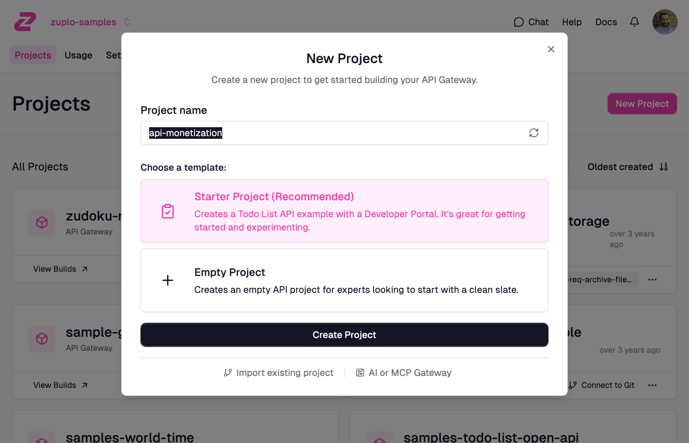
1. Connect your project to source control by following our
   [GitHub setup guide](https://zuplo.com/docs/articles/source-control-setup-github).

## Enable the monetization plugin

You'll need to make a quick edit in the portal to enable monetization in your
developer portal.

1. In your project, navigate to the **Code** tab.

2. In the file tree on the left, find and open `docs/zudoku.config.tsx`.

3. Add the monetization plugin import at the top of the file:

   ```tsx
   import { zuploMonetizationPlugin } from "@zuplo/zudoku-plugin-monetization";
   ```

4. Then add the plugin to your `plugins` array in the config:

   ```tsx
   const config: ZudokuConfig = {
     // ... your existing config
     plugins: [
       zuploMonetizationPlugin(),
       // ... any other plugins you have
     ],
     // ...
   };
   ```

   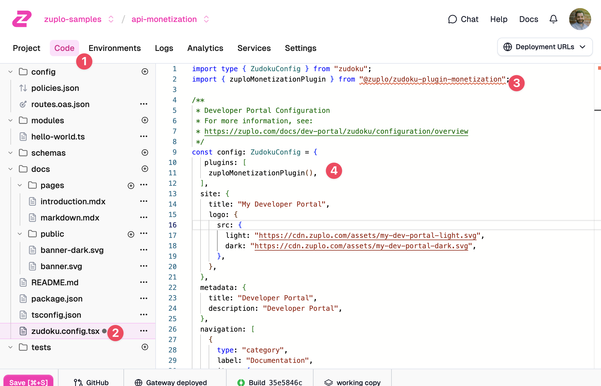

5. Save the file and ensure that a new environment is deployed.

## Configuring the Monetization Service

1. Navigate to the **Services** tab in your project.
2. Select the environment you want to configure (e.g., **Working Copy**).
3. Click **Configure** on the **Monetization Service** card.

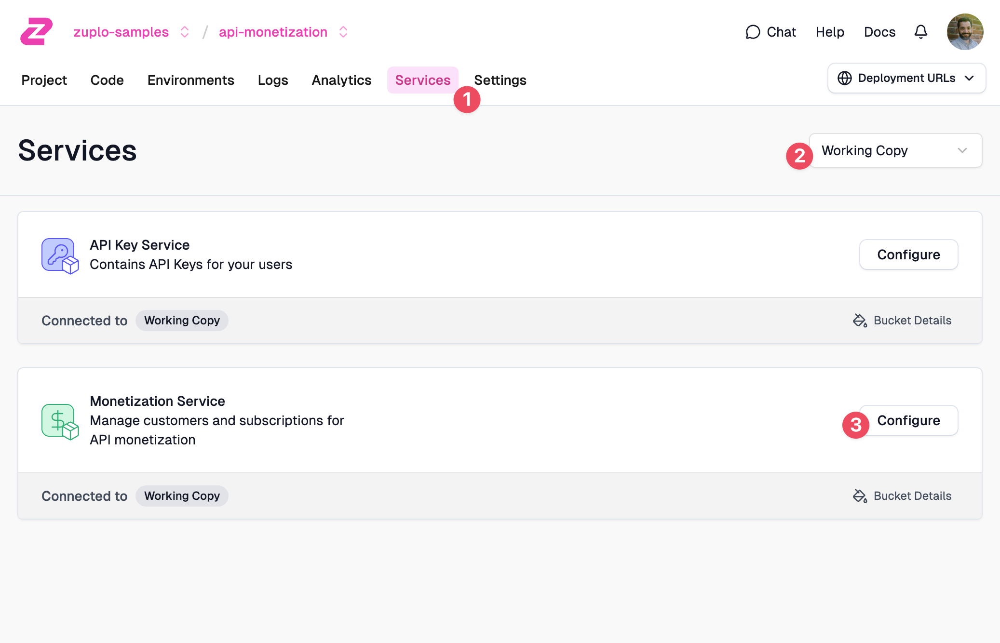

## Create a meter

Meters are the foundation of usage-based billing — they track what you want to
measure. Think of a meter as a counter that keeps track of things like API
calls, tokens processed, or data transferred.

Let's create a meter that tracks API requests:

1. In the Monetization Service, click the **Meters** tab.
2. Click **Add Meter** and select **Blank Meter**.

   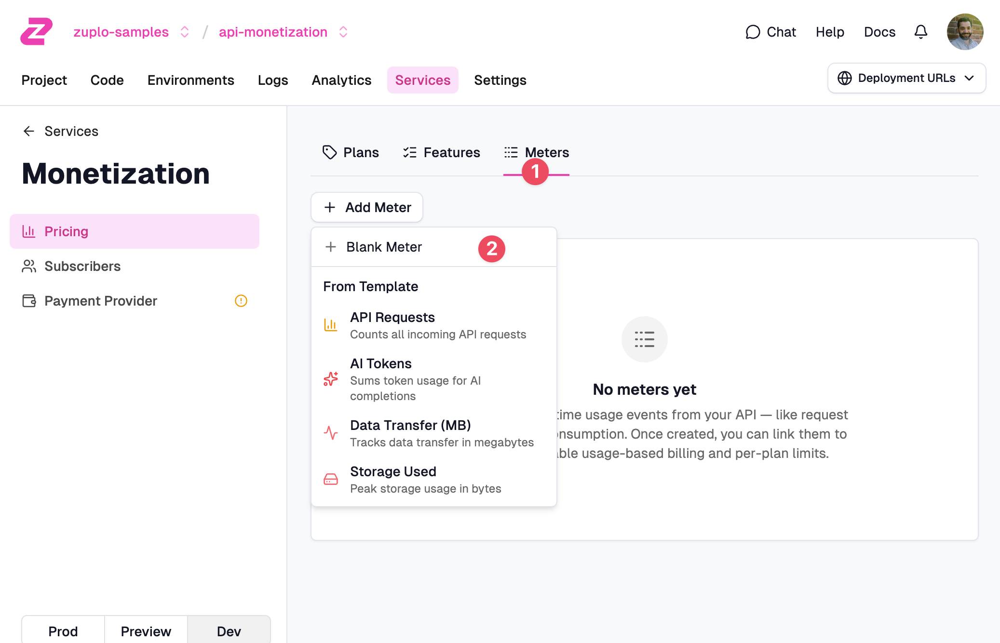

3. Fill in the meter details:
   - **Name**: `API`
   - **Event**: `api`
   - **Description**: `API Calls`
   - **Aggregation**: `SUM`
   - **Value Property**: `$.total`

4. Click **Add Meter** to save.

   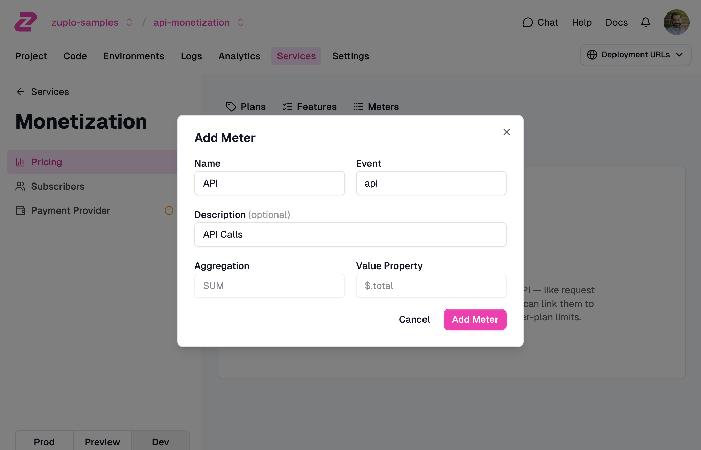

A few things to note:

- **Event**: The type of event to listen for
- **Aggregation**: How to combine values (SUM, COUNT, MAX, etc.)
- **Value Property**: A JSONPath expression to extract the value from events

## Create features

Features define what your customers get access to. They can be tied to meters
(for usage-based features) or standalone (for boolean features like "Metadata
Support").

We'll create three features for our plans. In the Monetization Service, click
the **Features** tab, then click **Add Feature** for each one:

**1. API Feature** (linked to our meter):

- **Name**: `api`
- **Key**: `api`
- **Linked Meter**: `API`

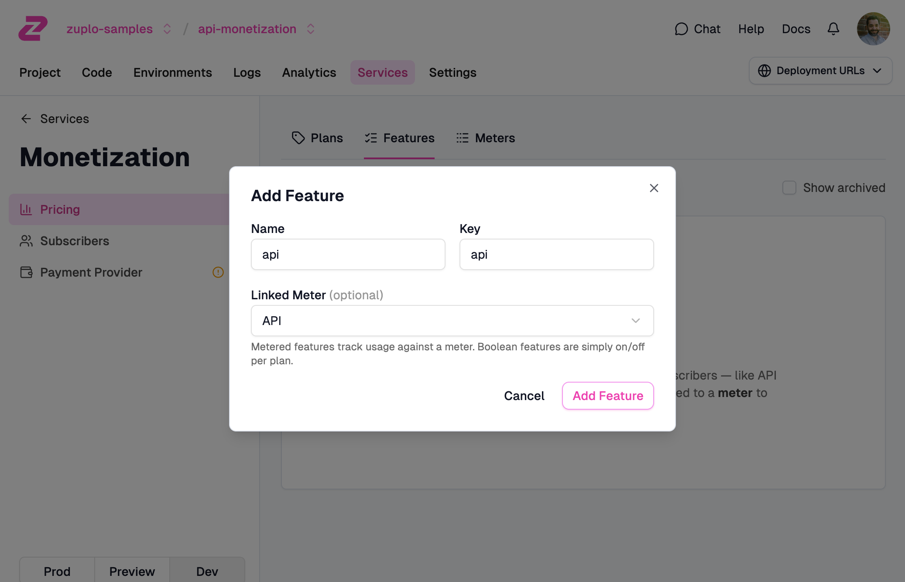

**2. Monthly Fee Feature** (for flat-rate billing):

- **Name**: `Monthly Fee`
- **Key**: `monthly_fee`
- **Linked Meter**: leave empty

**3. Metadata Support Feature** (a boolean feature):

- **Name**: `Metadata Support`
- **Key**: `metadata_support`
- **Linked Meter**: leave empty

Once all three features are created, your Features tab should look like this:

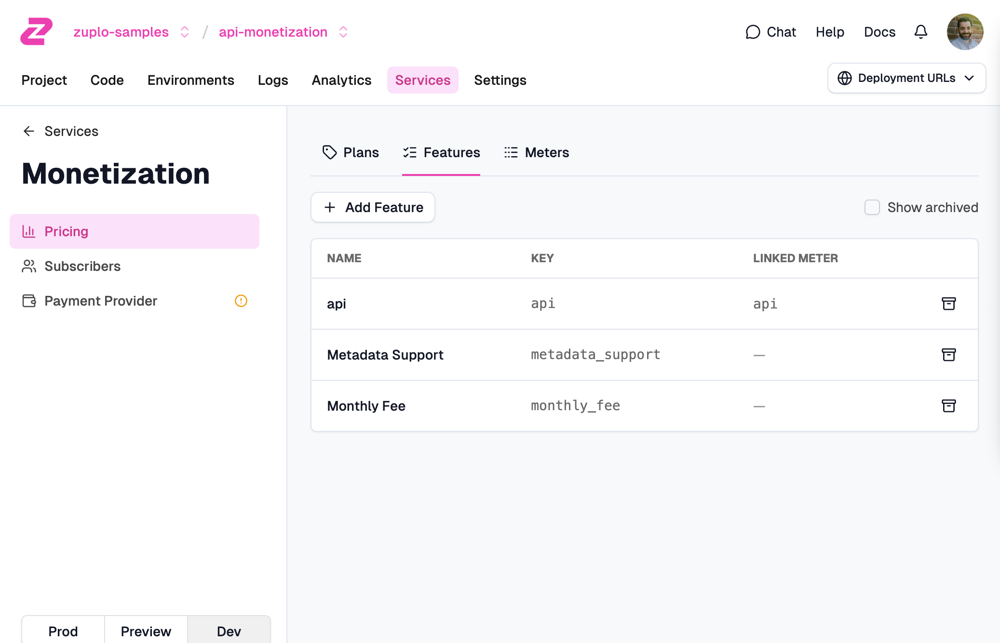

## Create plans

Now for the fun part — let's create some pricing plans! Plans bring together
your features with pricing and entitlements. We'll create three plans to give
your customers options:

| Plan      | Monthly Fee | Included Requests | Overage Rate | Metadata Support |
| --------- | ----------- | ----------------- | ------------ | ---------------- |
| Developer | $9.99       | 1,000             | $0.10/req    | No               |
| Pro       | $19.99      | 5,000             | $0.05/req    | Yes              |
| Business  | $29.99      | 10,000            | $0.01/req    | Yes              |

### Developer Plan

The entry-level plan for developers getting started — includes 1,000 API
requests per month at $9.99, with overage charged at $0.10 per request.

1. In the **Plans** tab, click **Create Plan**.
2. Fill in the plan details:
   - **Plan Name**: `Developer`
   - **Key**: `developer`
3. Click **Create Draft**.

   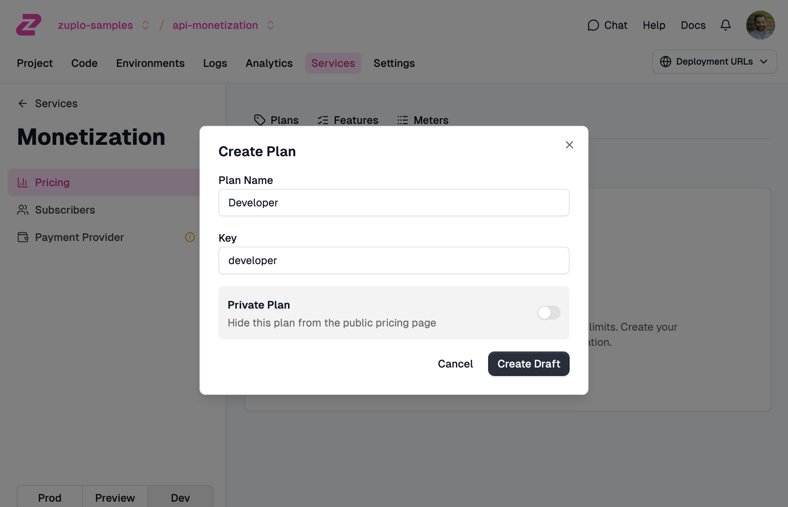

4. Configure the rate cards for the plan:

   **Monthly Fee** rate card:
   - **Pricing Model**: Flat fee
   - **Billing Cadence**: Monthly
   - **Payment Term**: In advance
   - **Price**: $9.99
   - **Entitlement**: No entitlement

   **api** rate card:
   - **Pricing Model**: Tiered
   - **Billing Cadence**: Monthly
   - **Price Mode**: Graduated
   - **Tier 1**: First Unit `0`, Last Unit `1000`, Unit Price $0, Flat Price $0
   - **Tier 2**: First Unit `1001`, to infinity, Unit Price $0.10, Flat Price $0
   - **Entitlement**: Metered (track usage)
   - **Usage Limit**: `1000`
   - **Soft limit**: enabled

5. Click **Save**.

   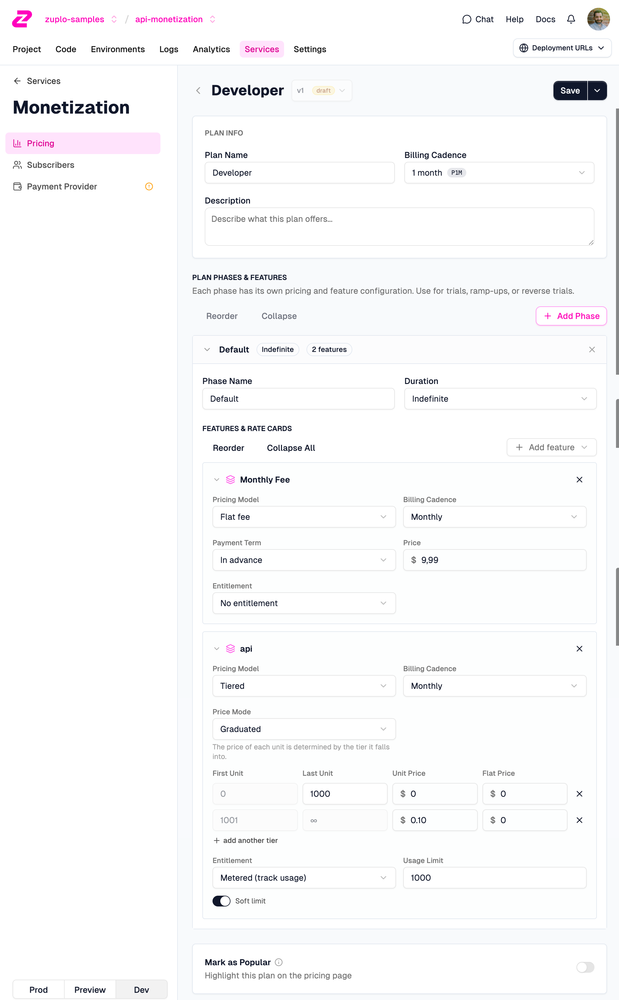

### Pro Plan

For growing teams that need more capacity — includes 5,000 API requests per
month at $19.99, with overage charged at $0.05 per request, plus Metadata
Support.

1. In the **Plans** tab, click **Create Plan**.
2. Fill in the plan details:
   - **Plan Name**: `Pro`
   - **Key**: `pro`
3. Click **Create Draft**.

4. Configure the rate cards for the plan:

   **Monthly Fee** rate card:
   - **Pricing Model**: Flat fee
   - **Billing Cadence**: Monthly
   - **Payment Term**: In advance
   - **Price**: $19.99
   - **Entitlement**: No entitlement

   **api** rate card:
   - **Pricing Model**: Tiered
   - **Billing Cadence**: Monthly
   - **Price Mode**: Graduated
   - **Tier 1**: First Unit `0`, Last Unit `5000`, Unit Price $0, Flat Price $0
   - **Tier 2**: First Unit `5001`, to infinity, Unit Price $0.05, Flat Price $0
   - **Entitlement**: Metered (track usage)
   - **Usage Limit**: `5000`
   - **Soft limit**: enabled

   **Metadata Support** rate card:
   - **Entitlement**: Boolean
   - **Enabled**: true

5. Click **Save**.

   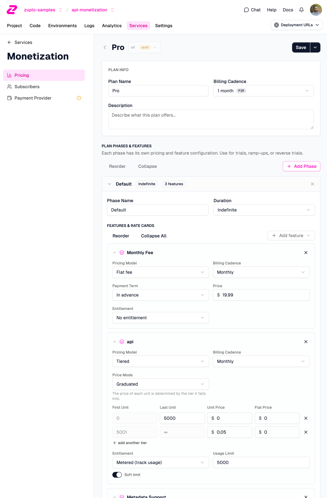

### Business Plan

For high-volume users who want the best overage rates — includes 10,000 API
requests per month at $29.99, with overage charged at $0.01 per request, plus
Metadata Support.

1. In the **Plans** tab, click **Create Plan**.
2. Fill in the plan details:
   - **Plan Name**: `Business`
   - **Key**: `business`
3. Click **Create Draft**.

4. Configure the rate cards for the plan:

   **Monthly Fee** rate card:
   - **Pricing Model**: Flat fee
   - **Billing Cadence**: Monthly
   - **Payment Term**: In advance
   - **Price**: $29.99
   - **Entitlement**: No entitlement

   **api** rate card:
   - **Pricing Model**: Tiered
   - **Billing Cadence**: Monthly
   - **Price Mode**: Graduated
   - **Tier 1**: First Unit `0`, Last Unit `10000`, Unit Price $0, Flat Price $0
   - **Tier 2**: First Unit `10001`, to infinity, Unit Price $0.01, Flat Price $0
   - **Entitlement**: Metered (track usage)
   - **Usage Limit**: `10000`
   - **Soft limit**: enabled

   **Metadata Support** rate card:
   - **Pricing Model**: Free
   - **Entitlement**: Boolean (on/off)

5. Click **Save**.

   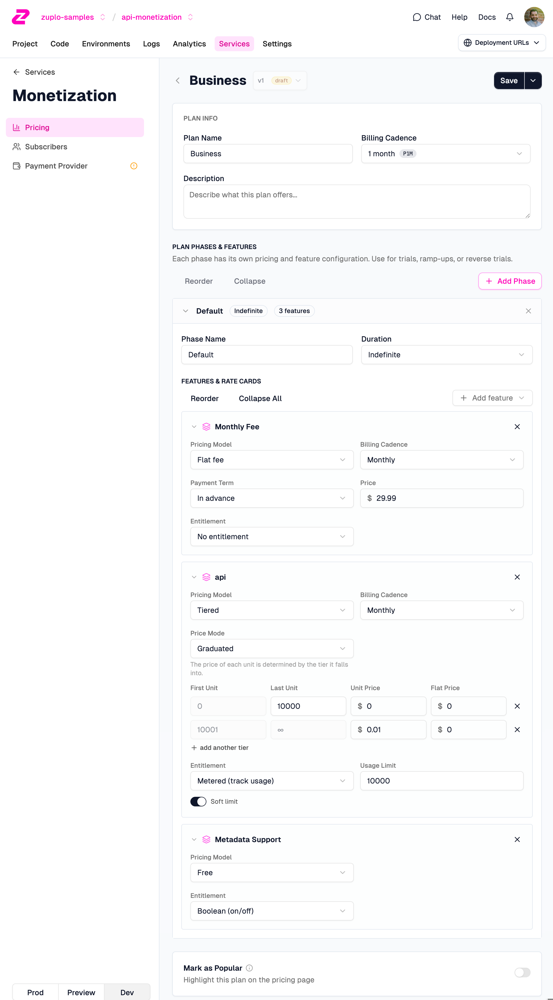

### Reorder your plans

The order of plans on the Plans tab determines how they appear on your pricing
page. By default, newly created plans are added to the end. Drag and drop the
plans using the handle on the top-left corner of each card to reorder them as
**Developer**, **Pro**, **Business**.

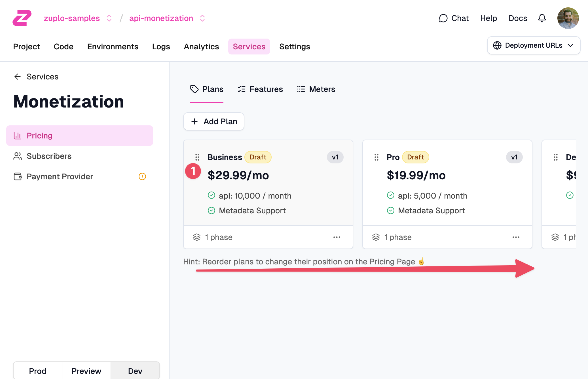

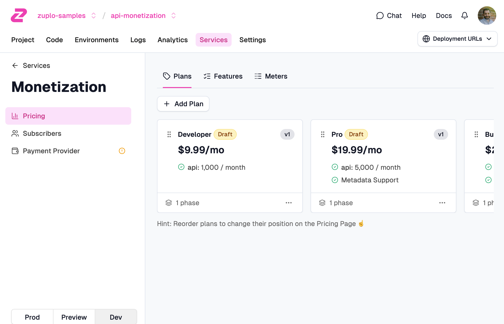

### Publish your plans

Each plan starts as a draft. You'll need to publish each one before customers
can subscribe.

1. On each plan card, click the **...** context menu.
2. Select **Publish Plan**.
3. Repeat for all three plans (Developer, Pro, Business).

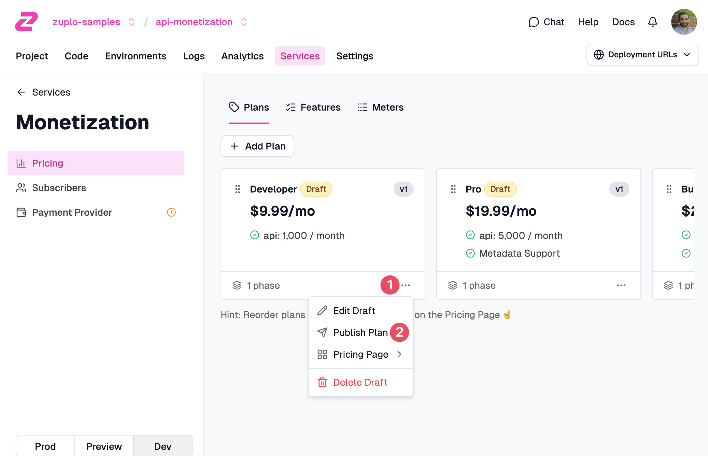

For more plan examples (including trial periods and multiple tiers), check out
our
[plan examples documentation](https://zuplo.com/docs/articles/monetization/plan-examples)

Need invite-only pricing for specific users? See
[Private Plans: Invite-Only Subscriptions](./PRIVATE_PLANS_README.md).

## Connect to Stripe

For testing, we recommend using Stripe's sandbox mode so you can simulate
payments without real charges. Here's how to set it up:

1. Head to your [Stripe Dashboard](https://dashboard.stripe.com) and make sure
   you're in **sandbox mode** (toggle in the top-right corner).

2. Go to **Developers > API keys** and copy your **Secret key** (it should start
   with `sk_test_`).

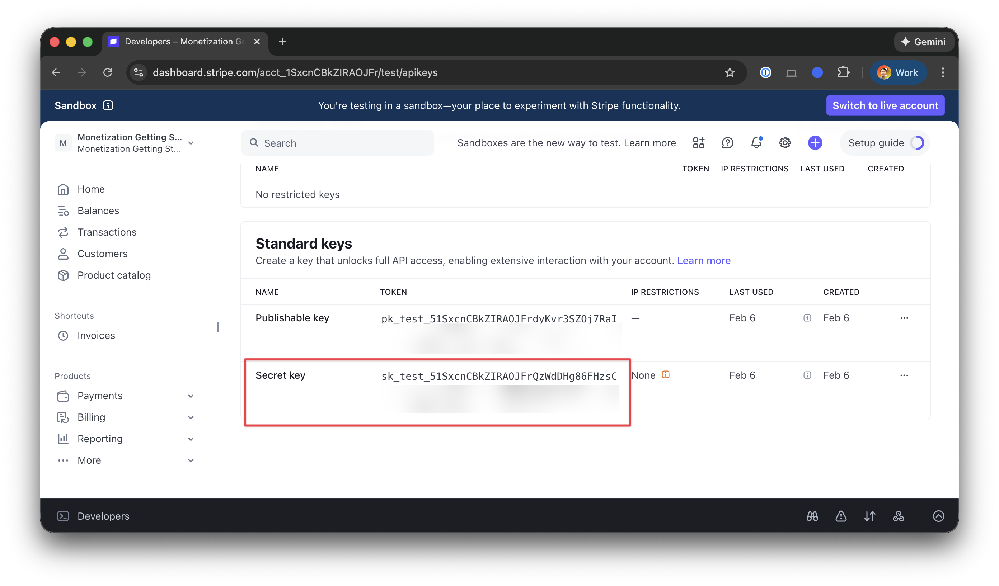

3. In the Monetization Service, click **Payment Provider** in the left sidebar.
4. Click **Configure** on the Stripe card.

   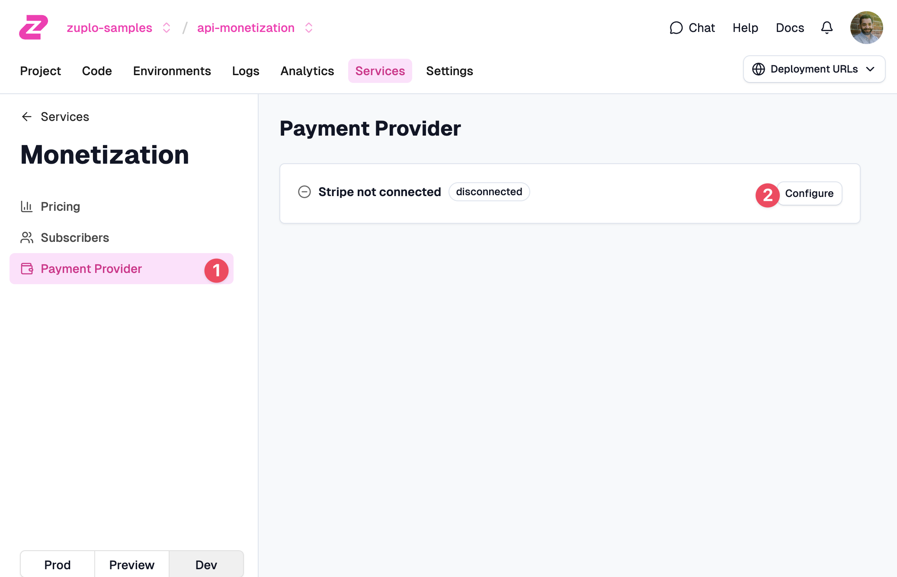

5. Enter a **Name** and paste your **Stripe API Key**, then click **Save**.

   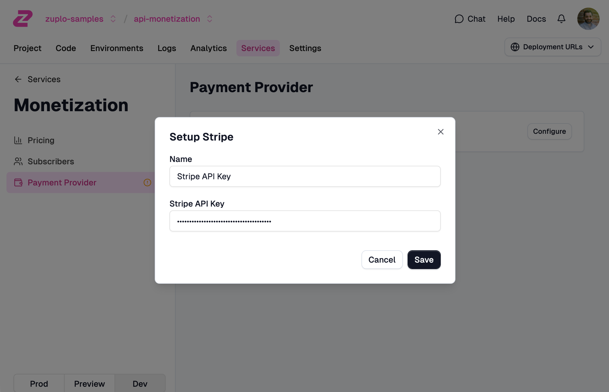

**Important:** Always use your Stripe **test** key (`sk_test_...`) while
following this guide. This creates a sandbox environment where you can safely
test subscriptions and payments without processing real transactions. When
you're ready for production, you can update to your live key (`sk_live_...`).

## Enable monetization policy

With your plans set up, you'll need to add a monetization policy to your API
routes. This policy checks entitlements and tracks usage automatically.

If you want more details and advanced configuration options (including dynamic
meter updates at runtime), see
[`MONETIZATION_POLICY_README.md`](./MONETIZATION_POLICY_README.md).

### Step 1: Define the monetization policy

Open `config/policies.json` and add the monetization policy:

```json
{
  "policies": [
    {
      "name": "monetization-v3",
      "policyType": "monetization-inbound",
      "handler": {
        "module": "$import(@zuplo/runtime)",
        "export": "MonetizationInboundPolicy",
        "options": {
          "meters": {
            "api": 1
          }
        }
      }
    }
  ]
}
```

A few things to note about the configuration:

- **name**: The identifier you'll use to reference this policy in your routes
- **meters**: Maps your meter slug (we created `api` earlier) to the number of
  units each request consumes. Here, each API call increments the meter by 1.

### Step 2: Apply the policy to your routes

Now open `config/routes.oas.json` and add the policy to the routes you want to
monetize. Find the route's `x-zuplo-route` section and add the policy to the
`inbound` array:

```json
{
  "paths": {
    "/todos": {
      "get": {
        "summary": "Get all todos",
        "operationId": "get-all-todos",
        "x-zuplo-route": {
          "corsPolicy": "none",
          "handler": {
            "export": "urlForwardHandler",
            "module": "$import(@zuplo/runtime)",
            "options": {
              "baseUrl": "https://todo.zuplo.io"
            }
          },
          "policies": {
            "inbound": ["monetization-v3"]
          }
        }
      }
    }
  }
}
```

The key part is the `policies.inbound` array — this tells Zuplo to run the
`monetization-v3` policy before forwarding the request. The policy will:

1. Check if the user has an active subscription
2. Verify they have remaining entitlements for the `api` feature
3. Track usage against their meter
4. Block the request if they've exceeded their limits (unless `isSoftLimit` is
   enabled)

You can add the `monetization-v3` policy to as many routes as you'd like. Any
route with this policy will be metered and subject to the user's plan limits.

## Publish your changes

1. Commit and push your changes to your repository.
2. This triggers a deployment on Zuplo.
3. Go to [portal.zuplo.com](https://portal.zuplo.com), select your project, and
   wait for the deployment to complete.
4. Once it's done, navigate to your Developer Portal to see everything in
   action.

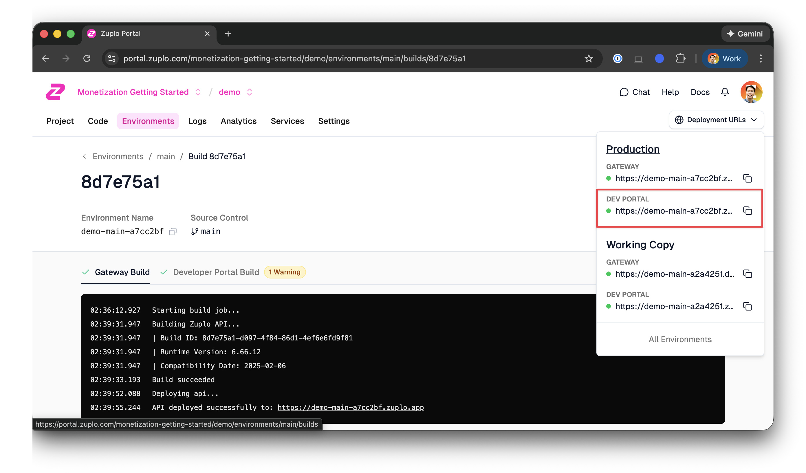

## Subscribe to a plan

Let's walk through the experience your customers will have when subscribing to
your API.

1. Navigate to your Developer Portal and select the **Pricing** tab in the top
   navigation.
2. Click **Subscribe** on one of the available plans.

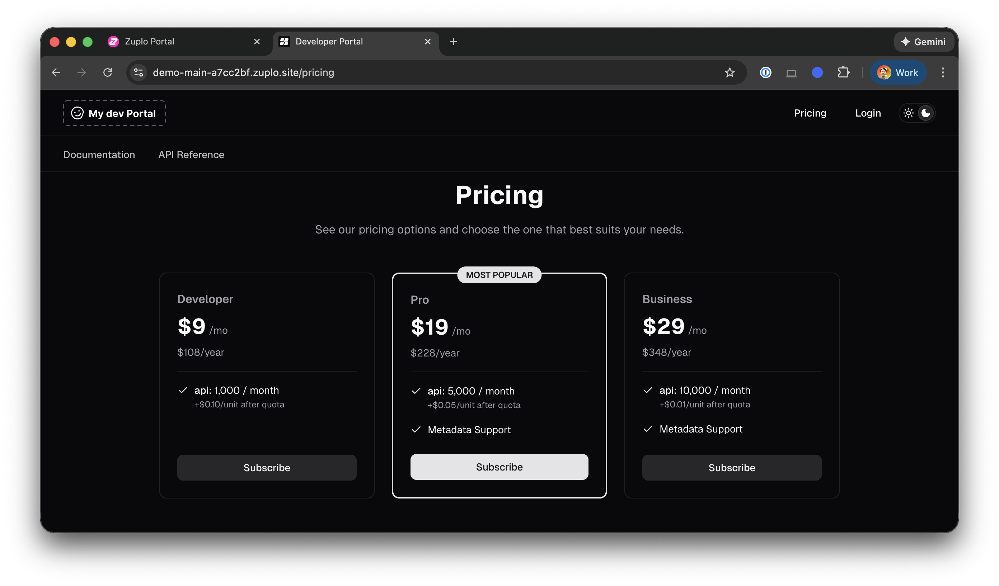

3. You'll be prompted to enter payment information. Since we're using Stripe's
   sandbox, you can use [test card numbers](https://docs.stripe.com/testing) —
   no real charges will be made.

4. Once your subscription is confirmed, you'll see your usage dashboard and API
   keys.

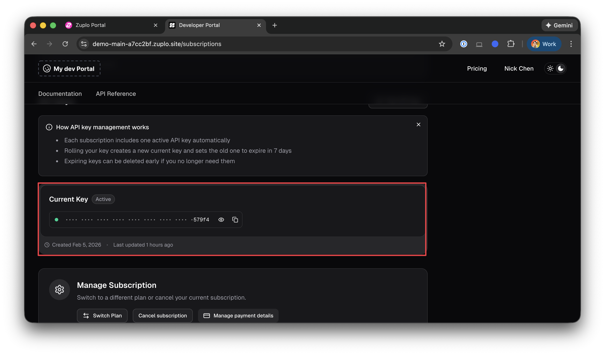

## Make a call to your API


1. Copy the API key from your subscription and make a few requests to the
   `/todos` endpoint on your API Gateway:

```bash
curl --request GET \
  --url https://<your-gateway-url>/todos \
  --header 'Authorization: Bearer <your-api-key>'
```

2. Head back to your Developer Portal — you should see your `api` meter
   decrement with each call.

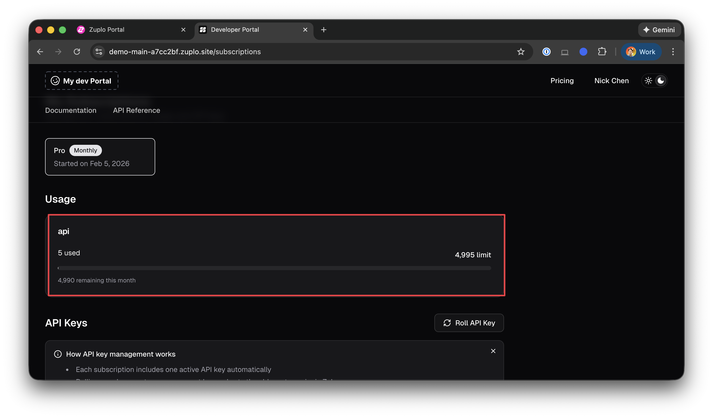

## Next steps

Congratulations — you've set up monetization for your API! Here are some ideas
for what to explore next:

- **Customize your plans**: Experiment with different pricing tiers, trial
  periods, and feature combinations. See our
  [plan examples](https://zuplo.com/docs/articles/monetization/plan-examples)
  for inspiration.
- **Add more meters**: Track different types of usage (tokens, data transfer,
  etc.) across your API.

We'd love to hear your feedback as you explore! Since this is an early preview,
your input helps shape the future of this feature.
