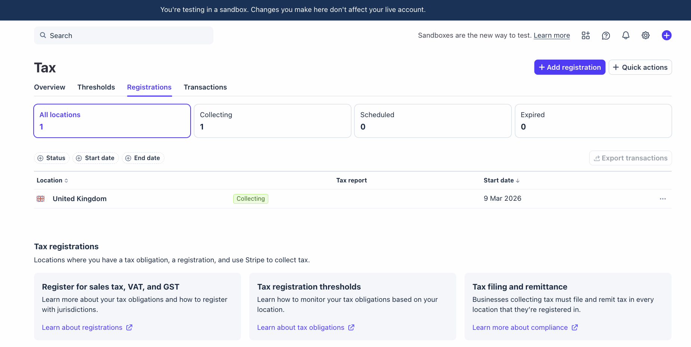
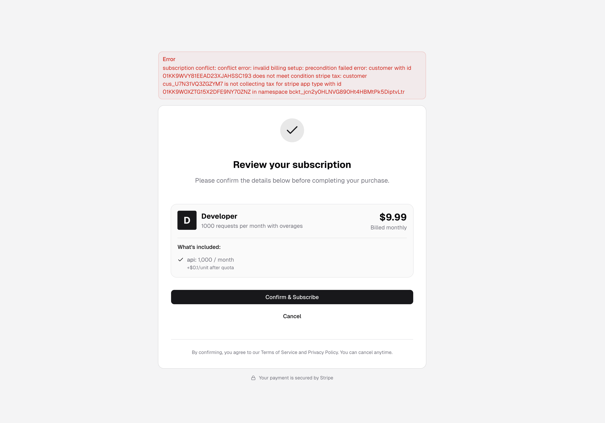
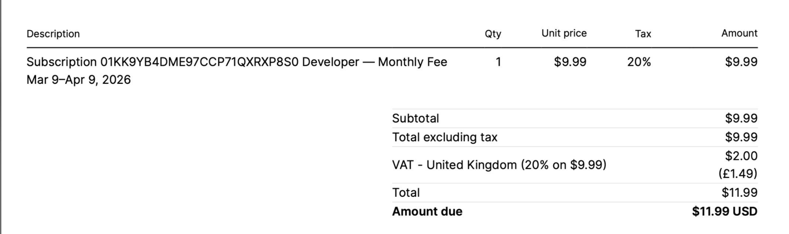

# Tax Collection: Enabling Stripe Tax on Billing Profiles

This guide shows how to enable automatic tax collection on your billing
profile using Stripe Tax. When enabled, taxes (such as VAT, sales tax, or GST)
are automatically calculated and added to your customers' invoices.

If you have not completed the base setup yet, start with the main
[Getting Started guide](./README.md).

## Prerequisites

Before continuing, make sure you already have:

- `ZUPLO_API_KEY`
- `ZUPLO_BUCKET_ID`
- Stripe API key configured through the Zuplo portal UI
- A billing profile created (this happens automatically during initial setup)

## Set up Stripe API key

Before configuring tax collection, ensure your Stripe API key is set up through
the Zuplo portal UI. This connects your Stripe account to Zuplo and is required
for all billing and tax operations.

## Add tax registrations in Stripe

You must add tax registrations in Stripe for every country where you are
required to collect tax. Without a registration, Stripe Tax cannot calculate
taxes for customers in that country.

Go to your Stripe Tax registrations page:
`https://dashboard.stripe.com/YOUR_ACCOUNT_ID/test/tax/registrations`

Click **+ Add registration** and add each country where you have a tax
obligation.



## List billing profiles

First, retrieve your billing profiles to find the billing profile ID.

```bash
curl -X GET "https://dev.zuplo.com/v3/metering/${ZUPLO_BUCKET_ID}/billing/profiles" \
  -H "Authorization: Bearer ${ZUPLO_API_KEY}" \
  -H "Content-Type: application/json"
```

Example response:

```json
{
  "items": [
    {
      "apps": {
        "invoicing": {
          "id": "01KK9W0XZTG15X2DFE9NY70ZNZ"
        },
        "payment": {
          "id": "01KK9W0XZTG15X2DFE9NY70ZNZ"
        },
        "tax": {
          "id": "01KK9W0XZTG15X2DFE9NY70ZNZ"
        }
      },
      "createdAt": "2026-03-09T17:58:52.748544Z",
      "default": true,
      "description": "Stripe Billing Profile, created automatically",
      "id": "01KK9W0YJCG1NPMTTTJWVA9CTX",
      "metadata": null,
      "name": "Stripe Billing Profile",
      "supplier": {
        "addresses": [
          {
            "country": "US"
          }
        ],
        "name": "Stripe Account"
      },
      "updatedAt": "2026-03-09T18:58:50.906939Z",
      "workflow": {
        "collection": {
          "alignment": {
            "type": "subscription"
          },
          "interval": "P0D"
        },
        "invoicing": {
          "autoAdvance": true,
          "draftPeriod": "P0D",
          "dueAfter": "P0D",
          "progressiveBilling": true
        },
        "payment": {
          "collectionMethod": "charge_automatically"
        },
        "tax": {
          "enabled": true,
          "enforced": true
        }
      }
    }
  ],
  "page": 1,
  "pageSize": 100,
  "totalCount": 1
}
```

Save the `id` from the billing profile in the `items` array as
`BILLING_PROFILE_ID`. You will use this for all subsequent requests.

## Get your current billing profile

Now retrieve the full billing profile using the ID from the previous step. You
will need the full response body for the update request.

```bash
curl -X GET "https://dev.zuplo.com/v3/metering/${ZUPLO_BUCKET_ID}/billing/profiles/${BILLING_PROFILE_ID}" \
  -H "Authorization: Bearer ${ZUPLO_API_KEY}" \
  -H "Content-Type: application/json"
```

Example response:

```json
{
  "apps": {
    "invoicing": {
      "id": "01KK9W0XZTG15X2DFE9NY70ZNZ"
    },
    "payment": {
      "id": "01KK9W0XZTG15X2DFE9NY70ZNZ"
    },
    "tax": {
      "id": "01KK9W0XZTG15X2DFE9NY70ZNZ"
    }
  },
  "createdAt": "2026-03-09T17:58:52.748544Z",
  "default": true,
  "description": "Stripe Billing Profile, created automatically",
  "id": "01KK9W0YJCG1NPMTTTJWVA9CTX",
  "metadata": null,
  "name": "Stripe Billing Profile",
  "supplier": {
    "addresses": [
      {
        "country": "US"
      }
    ],
    "name": "Stripe Account"
  },
  "updatedAt": "2026-03-09T18:58:50.906939Z",
  "workflow": {
    "collection": {
      "alignment": {
        "type": "subscription"
      },
      "interval": "P0D"
    },
    "invoicing": {
      "autoAdvance": true,
      "draftPeriod": "P0D",
      "dueAfter": "P0D",
      "progressiveBilling": true
    },
    "payment": {
      "collectionMethod": "charge_automatically"
    },
    "tax": {
      "enabled": false,
      "enforced": false
    }
  }
}
```

## Update billing profile to enable tax collection

Use the PUT endpoint to update the billing profile. You need to change two
things:

1. **Set the correct supplier country** in `supplier.addresses[0].country`.
   This is critical because tax calculation depends on your supplier country. It
   defines what taxes your company is required to collect and what taxes it is
   not. Use the [ISO 3166-1 alpha-2](https://en.wikipedia.org/wiki/ISO_3166-1_alpha-2)
   country code (e.g., `US`, `GB`, `DE`).

2. **Enable tax collection** by setting `workflow.tax.enabled` and
   `workflow.tax.enforced` to `true`.

```bash
curl -X PUT "https://dev.zuplo.com/v3/metering/${ZUPLO_BUCKET_ID}/billing/profiles/${BILLING_PROFILE_ID}" \
  -H "Authorization: Bearer ${ZUPLO_API_KEY}" \
  -H "Content-Type: application/json" \
  -d '{
    "apps": {
      "invoicing": {
        "id": "01KK9W0XZTG15X2DFE9NY70ZNZ"
      },
      "payment": {
        "id": "01KK9W0XZTG15X2DFE9NY70ZNZ"
      },
      "tax": {
        "id": "01KK9W0XZTG15X2DFE9NY70ZNZ"
      }
    },
    "createdAt": "2026-03-09T17:58:52.748544Z",
    "default": true,
    "description": "Stripe Billing Profile, created automatically",
    "id": "01KK9W0YJCG1NPMTTTJWVA9CTX",
    "metadata": null,
    "name": "Stripe Billing Profile",
    "supplier": {
      "addresses": [
        {
          "country": "GB"
        }
      ],
      "name": "Stripe Account"
    },
    "updatedAt": "2026-03-09T17:58:52.983949Z",
    "workflow": {
      "collection": {
        "alignment": {
          "type": "subscription"
        },
        "interval": "P0D"
      },
      "invoicing": {
        "autoAdvance": true,
        "draftPeriod": "P0D",
        "dueAfter": "P0D",
        "progressiveBilling": true
      },
      "payment": {
        "collectionMethod": "charge_automatically"
      },
      "tax": {
        "enabled": true,
        "enforced": true
      }
    }
  }'
```

## Tax settings explained

The `workflow.tax` object controls how tax collection behaves. There are three
possible configurations:

| `enabled` | `enforced` | Behavior |
|-----------|-----------|----------|
| `false` | `false` | **No tax calculation.** Stripe Tax is not used at all. Invoices are created without any tax lines. |
| `true` | `false` | **Best-effort tax calculation.** Tax calculation is attempted via Stripe Tax. If it fails (e.g., the customer has no valid tax location or there is no tax registration for their country), the invoice is finalized without tax. Customers are not blocked from creating or updating subscriptions. |
| `true` | `true` | **Strict tax enforcement.** Tax calculation is required. If Stripe Tax returns an error (e.g., invalid customer tax location or missing tax registration for their country), the invoice finalization fails and the customer cannot complete the purchase. |

## Optional: Tax behavior configuration

You can also configure whether tax is **included in the price** or **added on
top of it** by adding a `defaultTaxConfig` to the `invoicing` section of your
billing profile:

```json
"invoicing": {
    "autoAdvance": true,
    "draftPeriod": "P0D",
    "dueAfter": "P0D",
    "progressiveBilling": true,
    "defaultTaxConfig": {
        "behavior": "exclusive",
        "stripe": {
            "code": "txcd_10000000"
        }
    }
}
```

- **`behavior: "exclusive"`** — Tax is added on top of the listed price. If your
  plan costs $9.99 and 20% VAT applies, the customer pays $11.99.
- **`behavior: "inclusive"`** — Tax is already included in the listed price. The
  plan costs $9.99 total, with tax extracted from that amount.
- **`stripe.code`** — The Stripe Tax code for your product category. `txcd_10000000`
  is the general "Software as a Service (SaaS) - business use" category.

## Enforcement and missing tax registrations

When `enforced` is set to `true` and a customer tries to subscribe from a
country where you have **not** added a Stripe tax registration, they will see an
error and will not be able to create new subscriptions or upgrade their
existing subscription:



### How to fix this

Add a tax registration for every country where you want to collect tax. Go to
your Stripe Tax registrations page:

`https://dashboard.stripe.com/YOUR_ACCOUNT_ID/test/tax/registrations`

Click **+ Add registration** and add the missing country.

### Alternative: Disable enforcement

If you do not want to block customers from countries where you have no tax
registration, set `enforced` to `false` while keeping `enabled` as `true`. In
this configuration:

- Customers from countries with a tax registration will have tax calculated and
  added to their invoices.
- Customers from countries **without** a tax registration will not be blocked.
  Their invoices will simply not contain any tax lines.
- Subscription purchases, upgrades, and downgrades will work for all customers
  regardless of their location.

## Invoice with tax collection

When tax collection is working correctly, your customers' invoices will include
tax line items. Here is an example of an invoice with 20% VAT applied:



In this example, the $9.99 monthly fee has 20% UK VAT ($2.00) added on top,
bringing the total amount due to $11.99 USD.

## Related guides

- Main walkthrough: [README.md](./README.md)
- Private plans: [PRIVATE_PLANS_README.md](./PRIVATE_PLANS_README.md)
